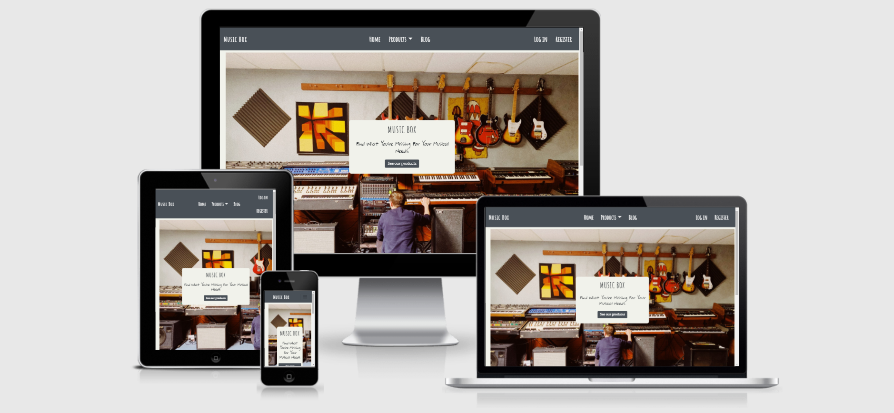
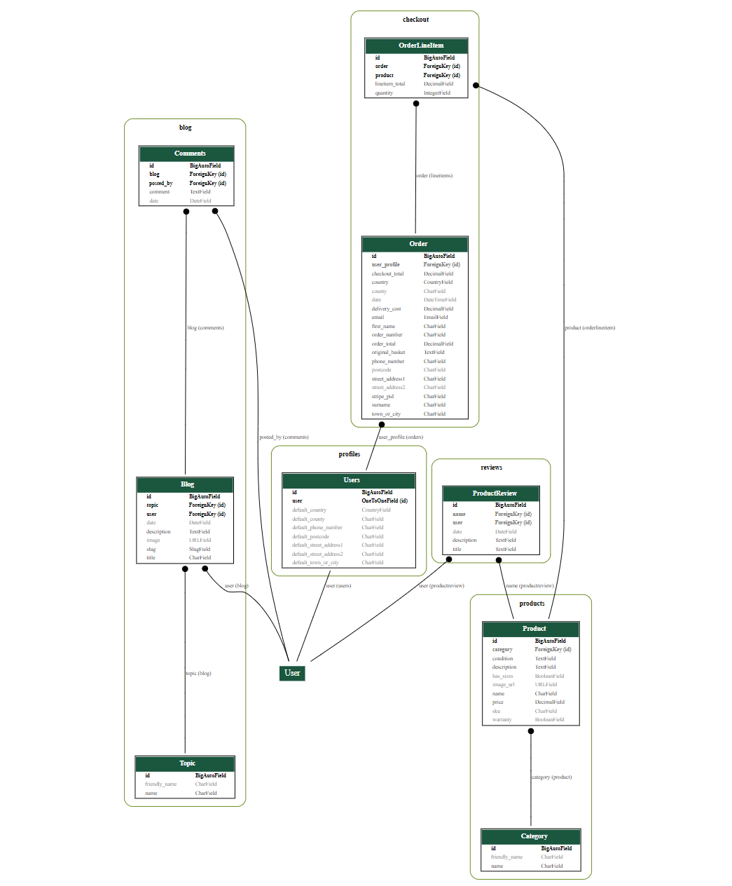
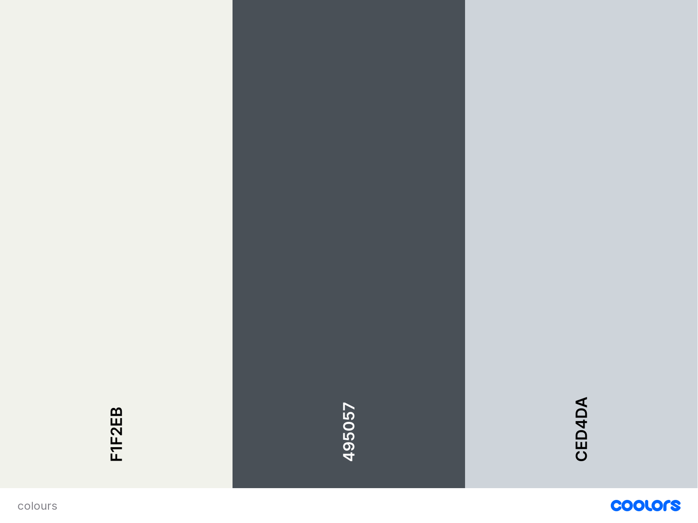
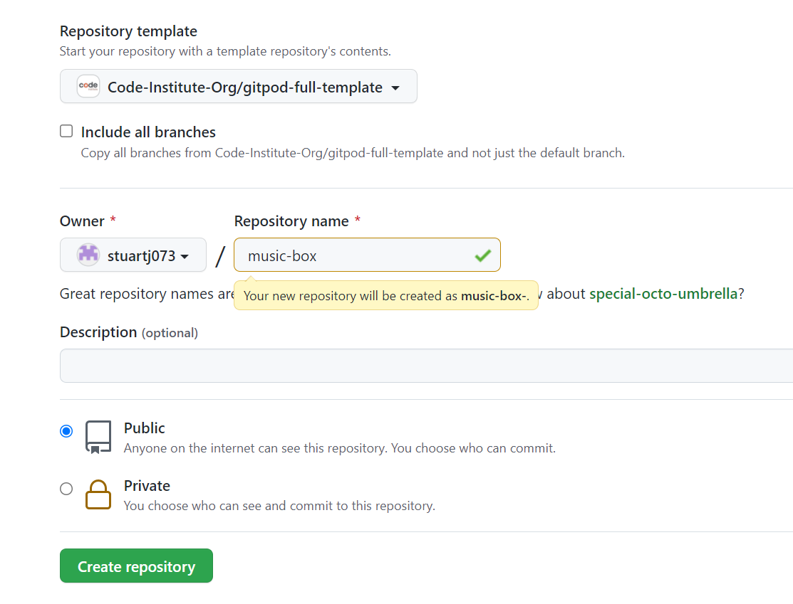
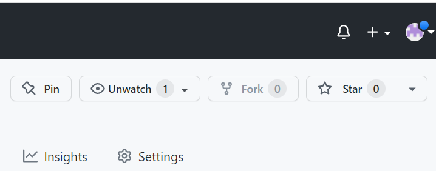
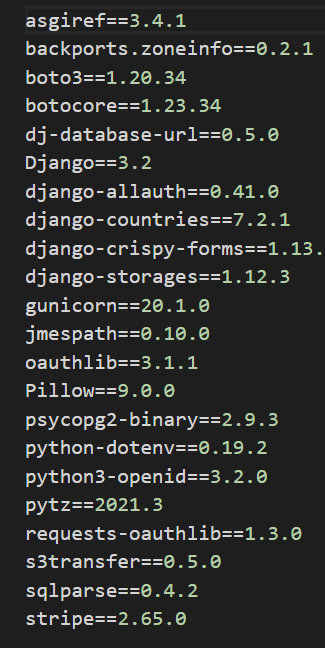
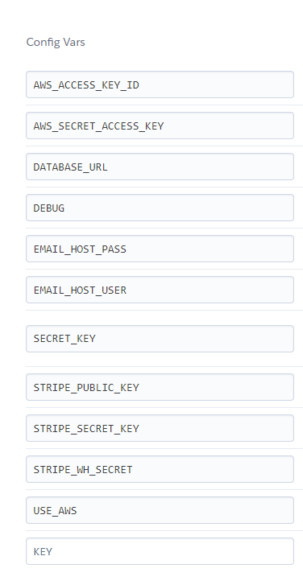
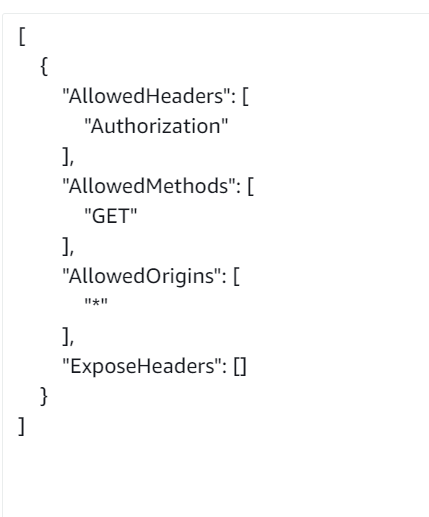
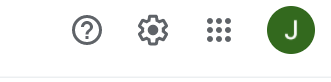
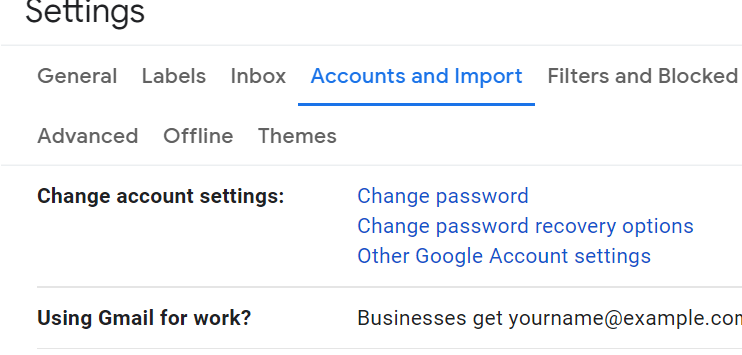

# Music Box

An idea I have thought about over the last number of years has been that of intertwining both a community whereby music enthusiasts and producers alike could share ideas, respond to one another and have a space whereby they can add to their arsenal of musical equipment. This project aims to explore the divide between e-commerce sites and that of music blog sites. 

With an informed outlook on a particular piece of equipment/machinery or instrument, members of the site can then browse the site picking up whichever item they feel would benefit their own studio or personal playing zone.

Aside from that, I aim for the site to be also enjoyed by those looking to just make a purchase on the site.

You can find the live site [here](https://music-box-stuartj.herokuapp.com/).

## User Stories 
### As a first time visitor...

- I want to land on a site that makes sense immediately.
- I want to be met with neat and presentable UX/UI.
- To see the products and/or categories available to me for purchase.
- See a written backdrop to the site and the see the main ethos of the site.
- Have the option of signing up/ registering.
- To scroll/navigate the site with ease.

### As a returning/registered visitor...

- I want to be able to sign in easily and have my details remembered.
- I want to be able to view my order history.
- To be able to interact with the site's basket feature.
- I want to have access to my own profile page.
- I want to be able to perform CRUD operations on any feature of the site where appropriate.
- I want to have/see feedback for every action I perform on the site.
- To upload items/reviews/blog posts onto the site.

### As admin...

- I want to have control over all user's actions on the site.
- I want to ensure all information provided on the site is just and correct.
- I want to control all content on the site.
- I want to have the ability to remove users and/or their items if I deem the nature of them false/offensive in any way.

## UX/UI

### Scope
From the outset of this project, I drafted up possible features to be included. These were then compared against eachother in terms of overall practicality for every potential visitor to the site.

#### Current Features

The following features were included within the site:

- Home page (with links to every part of the site)
- Products page 
- Interactive features
- Search bar
- Review feature
- Blog feature 
- All CRUD operations
- Log in page
- Register page
- Profile page
- Add product feature
- Back to top button
- Social links
- About section
- Shopping basket (available on every page - bar profile)

#### Features left to implement

- Direct messaging feature. Which allows user's to contact eachother regarding blog posts or products.
- Shop coupons. Eventually, I would like to incorporate a shop 'coupons' feature that rewards active members and those that are making quite a lot of purchase orders. With the project only in it's inception I would prefer to leave this feature to a later time.

### Structure

- The home (index) page will convey to the site visitor an immediate sense as to what the site is all about. The landing image which will show a musician at work amongst a plethora of different musical equipment along with the cover to the site which also contains a link to all products of the site.

- Product page will show every product that is available to purchase on the website. Each product will have basic information about the good along with a link to see the reviews, the create review page and if the user created the good/is the superuser the edit and delete buttons will render also.

- Individual product page will allow the customer to add the product to their shopping basket (along with how many of each said item).

- The basket page will outline the contents in the bag allowing the customer the option to edit the quantity of each item as well as removing the item from the basket entirely.

- Checkout page will render the payment form along with the amount the customer will have to pay. After successfully paying for the good the customer will be redirected to the payment success page which will outline a confirmation message.

- The blog page allows customers to enter information about anything related to music. Each blog will be allowed to view on their individual blog page as well as the option to edit and delte if the appropriate user is logged in.

#### Database

### Skeleton

At project inception I created wireframes for both mobile and dekstop. Although plans changed quite a bit throughout what was a very long two months of work, the general structure and layout didn't differ too much from these original blueprints.

[Desktop](wireframes/desktop)
[Phone](wireframes/phone)

### Surface

For this site I continued on with my same approach for the last two project in keeping the color content to a minimum as to not create a "colour-overload" experience for users to the site.

For the navbar I chose a "#495057" colour along with a "#fff" colour for the font to make it stand out. 

For the body I chose "#F1F2EB" as I felt it contrasted the navbar quite well and finally for the message success container I chose the "#CED4DA" colour.

## Testing
Testing can be found here [here](TESTING.md).

## Technologies used

### Languages

- Python 
- HTML5
- CSS3
- Javascript

### Frameworks % Libraries 

1. [Django](https://www.djangoproject.com/)

2. [Balsamiq](https://balsamiq.com/)
- For wireframes.

3. [Git](https://git-scm.com/)
- Used as version control with commits being pushed on to Github.

4. [Github](https://github.com/)
- Was used as the host for all work committed throughout the entire project before deploying on Heroku. All project files were hosted here and I made use of the Github 'issues' feature throughout my production process.

5. [Gitpod](https://www.gitpod.io/)
- Used as the IDE which was linked up to my github account.

6. [Heroku](https://dashboard.heroku.com/)
- Cloud application used to host my site.

7. [PEP8](http://pep8online.com/)
- Used to validate all python code in the project.

8. [JSHint](https://jshint.com/)
- Validator for all JavaScript code.

9. [W3C Validator](https://validator.w3.org/)
- Used to validate all HTML5 code.

10. [Jigsaw](https://jigsaw.w3.org/css-validator/)
- Used to validate all CSS files.

11. [Google Fonts](https://fonts.google.com/)
- Used to obtain the fonts for the site.

12. [Postgres](https://www.postgresql.org/)
- Database used for our data.

13. [Stripe](https://stripe.com/en-ie)
- Used for the online payment system.

14. [AWS](https://aws.amazon.com/)
- Used to host all static and medial files.

15. [Chrome Developer tools](https://developer.chrome.com/docs/devtools/)
- Used throughout my entire production process for styling/responsiveness and most importantly testing.

## Deployment 

For this project I utilised four different platforms to take care of each distinct aspect of the site.
For version control I used Git and to host the site itself I used Heroku. For the payment system I decided to go with Stripe and to take care of all the static and media files for the site I used the bucket feature of AWS.

### Github

#### Creating the repository

- Firstly, I had to create a repository on github. Located on either the github landing page (on the top left), or under the repositories tab located under tje github username tab (located on the top right) there lies a button that allows you to create a new repository. 
- Upon navigation to the create repository tab I then filled out the relevant info required for setting up my repository, using the code institute built in template along with the name of my repository along

.

#### Forking and cloning

- To fork the project simply log into github and just under the navbar to the right will be option to fork the respository. The fork should now be in your respositories tab.

- To clone by the command line simply click the button beside the green button titled `code`, there you will be given various options on how you would like to clone the repository. You must then type `git clone` into your own workspace along with the repo URL and enter.

In order to make a local copy of this project, you can clone it. In your IDE Terminal, type the following command to clone my repository:

- `git clone https://github.com/stuartj073/music-box.git`

Alternatively, if using Gitpod, you can click below to create your own workspace using this repository.

#### Other requirements

- Ensure that all packages are installed by using the pip3 install command in the CLI. 

### Heroku

After successfully assigning the environement variables in the settings.PY file the next step was to connect to a hosting site. 

The following steps were taken in setting up heroku:

1. Log in/ Register to heroku.
2. Create a new app and fill in all relevant information. (This button is located on the top right of the screen after successfully logging in.)
(docs/readme/readme-images/heroku-part1.png)
3. To configure the connection on gitpod a requirements.txt file has to be created. This can be accomplished by the following CLI command `pip3 freeze > requirements.txt`.
4. A Procfile must then be created with CLI command `web: gunicorn music-box.wsgi:application`. Ensure there is no extra blank lines in the file as this can cause the file to be incorrectly read.
5. If you have used the fixtures feature from django then the following command can load these files onto heroku. `python3 manage.py loaddata files.json`.
6. Log into heroku from the CLI by typing `heorku login -i`.
7. Temporarily disable collectstatic (DISABLE_COLLECTSTATIC=1) as we deploy.
8. Add your unique heroku app name to the ALLOWED_HOSTS section of settings.py and commit the changes.
9. Deply to heroku by using the `git push heroku main` command. If the git remote isn't initialised you must initialise it by running `heroku git:remote -a`.
10. Create a separate superuser to be used on the deployed site.
11. Return to the heroku site and relevant app name. Located the deploy tab for the app and navigate through to the method section choosing `Github` as the option.
12. Search for the github repositoray and connect.
(docs/readme/readme-images/heroku-part2.png)
13. You can now either choose to automatically deploy or manually deploy. Automatic deploy will deploy the project as per every change that is pushed from git to your heroku app.
14. Create a secret key varibale to be used for the env file and heroku configuration variables.
15. Connect The AWS bucket to configuration variables with all relevant keys and values.

#### Amazon AWS
The next step was to utilise a hosting platform for all media and static files for the site. For this project, I availed of Amazon AWS.

Below are the following steps that were used in order to get Amazon AWS up and running:

1. Register/sign in to the Amazon AWS service.
2. Create a new bucket below the S3 services section found on the landing screen along with 
choosing the closest region to you.
3. Uncheck the block all public access option and then create bucket.
4. In the properties tab enable the static website hosting option using the default values of index.html and errors.html.
5. Set up the the CORS configuration tab as follows:

6. Create a security policy: S3 Bucket Policy allowing all principles by adding a `*` , Amazon S3 services and Get Object action. 
7. Paste the ARN from your bucket policy and add a statement. Generate policy, copying and pasting into Bucket Policy adding `/*` at the end of the resource key to allow use of all pages.
8. Under public access select access to all List Objects.
9. Create a group for the bucket through IAM. 
10. Create policy by importing AWS S3 Full Access and add ARN from bucket to the policy resources. Attach policy to the group.
11. Create a user giving programmatic access and add user to the group. 
12. Download the CSV file to save the access key ID and the secret access key to be added to the environment and configuration variables.
13. Add AWS_STORAGE_BUCKET_NAME, AWS_S£_REGION_NAME = `eu-west-2` to settings.py.
14. Push changes to GitHub and check that all static files have been successfully implemented into the Build Log.
15. DISABLE_COLLECTSTATIC can now be deleted.

#### Email

The next step involved connecting up an email account to the project to allow for automated email notifications for services such as signing up and site purchases.

For this project, I utilised Gmails automated email service, the following steps were taken to ensure that the automated emails began sending:

1. Change the DEFAULT_FROM_EMAIL value to your own email in settings.py.
2. Log into your Gmail account and navigate to the settings page.

3. Click `Account and Imports` and choose `other Google Account Settings`.

4. Navigate to the security tab and select `Signing in to Google.`

5. Turn on the 2-step verification If you haven't and then click `Get Started`.
6. Sign in and verify your account turning on 2-step verification.
7. Navigate back to `Security` and go onto `App Passwords`.
8. Enter your password again and set App to ``mail`, Device to `other` and type in `Django`.
9. The following code that appears correlates to your `EMAIL_HOST_PASS` and `EMAIL_HOST_USER` variables. These are then added to the respective environment and configuration variables.

## Credits

### Content

- All images from the project were obtained through google images and [unsplash](https://unsplash.com/).
- Inspiration for the navbar was taking from this [site](https://www.codeply.com/go/qhaBrcWp3v).

### Acknowledgements

I'd like to place on record my sincere thanks to my mentor Tim Nelson. Tim was a bundle of joy to work with and it was an absolute pleasure to have worked with such a professional and insightful person for what was an incredibly stressful few months working on this project.

I'd also like to thank the wider Code Institute community through the slack channel for any queries I had throughout my time on the project.

## Reflections

In hindsight, I will be paying attention much more to the concept of unit testing. It is something that I paid less and less attention to as I struggled with various different aspects of the project. I only began to see the true importance of unit testing toward the very end of the project and it will be something I intend to focus on in much greater detail with every subsequent project I will be working on.
